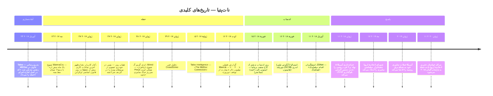
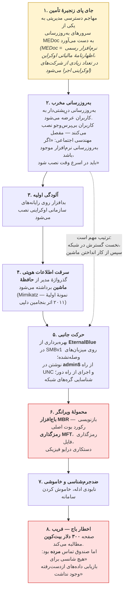
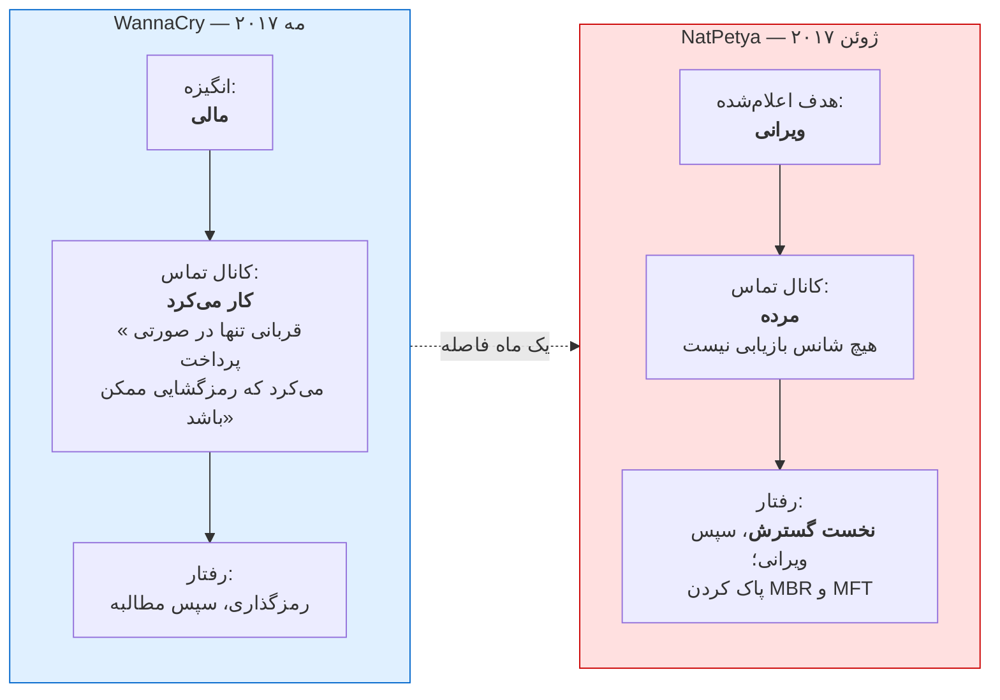
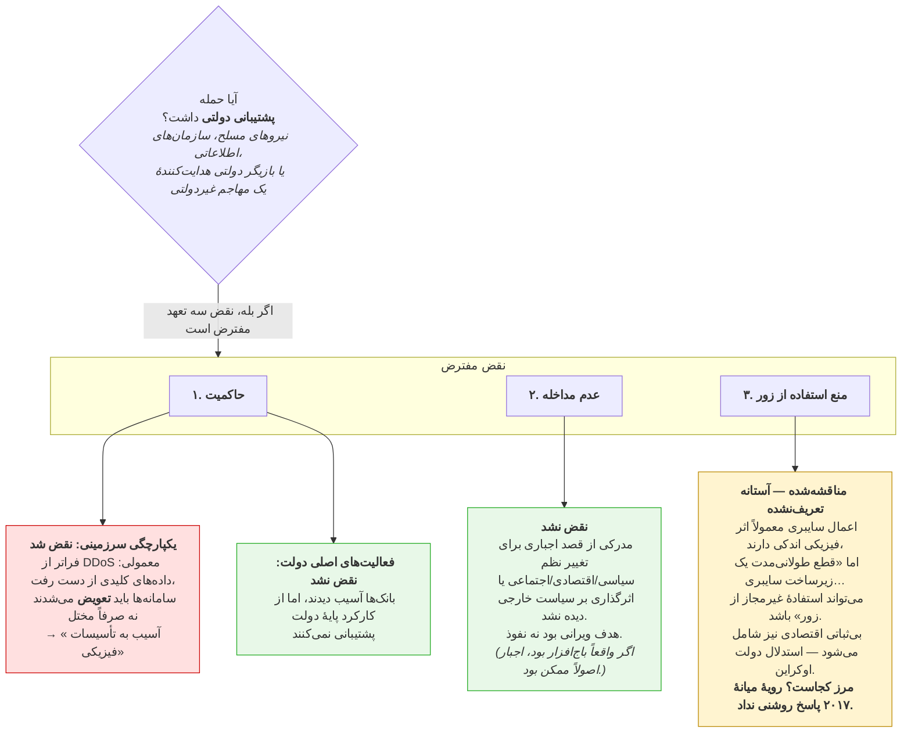
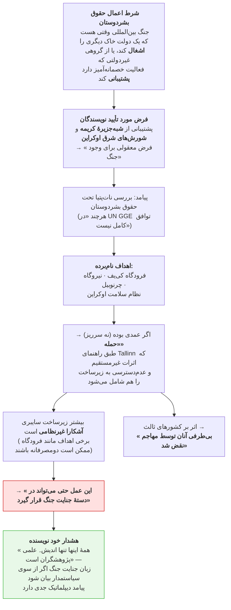
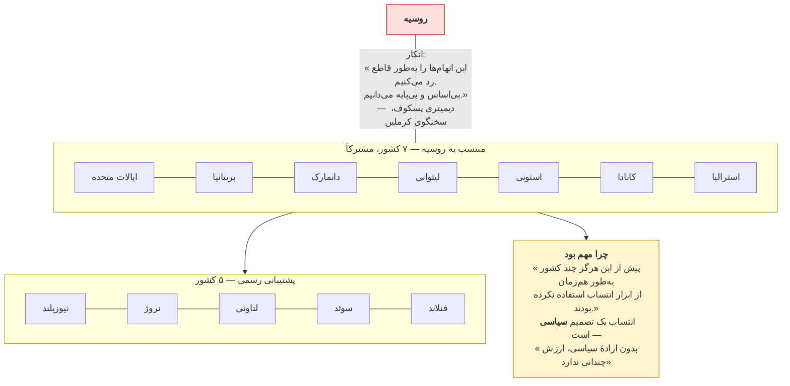
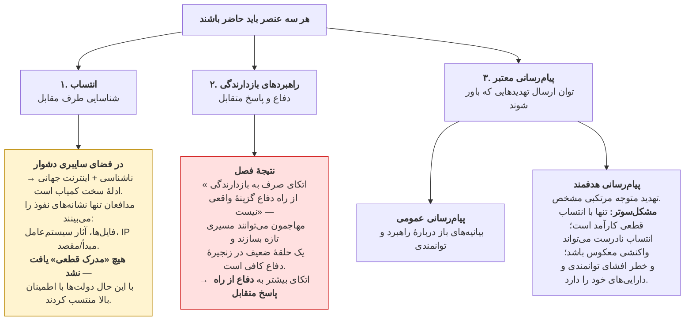
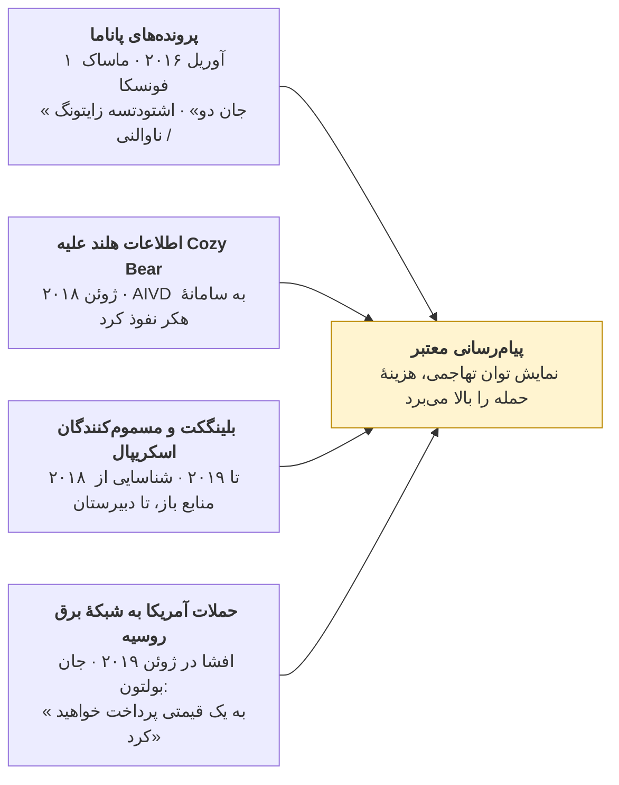
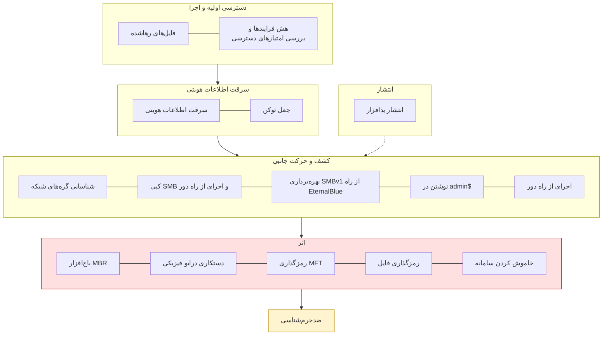

# نمودارها — کراسنای «مطالعهٔ موردی: کارزار نات‌پتیا»

نمودارهای Mermaid بازطراحی‌شده از *مطالعهٔ موردی: کارزار نات‌پتیا*، چابا کراسنای، در
*سایبر دیپلماسی از منظر اروپایی*، انتشارات دانشگاهی لودوویکا / دانشگاه خدمات عمومی ملی،
صفحات ۱۰۹–۱۲۷.

فصل اصلی **هیچ شکل یا جدول چاپی ندارد**؛ نمودارهای زیر از گاه‌شمار، روایت فنی و سه فهرست
شماره‌دار آن ساخته شده‌اند.

---

## ۱. گاه‌شمار: از آماده‌سازی تا انتساب هماهنگ

**چرا این تاریخ:** انتخاب یک تعطیلات ملی به‌عنوان آغاز «پیامی نمادین» بود؛ همچنین «اکثریت
اپراتورهای فناوری اطلاعات در مرخصی خواهند بودند، بنابراین دفاع با منابع کمتری کار خواهد کرد.»

---

## ۲. زنجیرهٔ کشت نات‌پتیا

**نشانهٔ تشخیصی، ترتیب اجراست.** یک بازیگر با انگیزهٔ مالی به ماشین زنده و کانال رمزگشایی کارآمد
نیاز دارد. اینجا ماشین نابود و صندوق مرده است — پس مطالبهٔ باج استتار بود، نه مدل کسب‌وکار.

---

## ۳. WannaCry در برابر نات‌پتیا

**دو نامتقارنی دیگر:** WannaCry نه کد پنهان داشت و نه «کلید توقف». درِ پشتی نات‌پتیا از ۲۴ آوریل
۲۰۱۷ در MEDoc نشسته بود. همچنین هیچ بات‌نت بزرگی در کار نبود.

---

## ۴. سه تعهد حقوق بین‌المللی (پس از اشمیت و بیلر)

### ۴-ب. در صورت مفروض بودن جنگ: حقوق بشردوستان و قاب‌بندی جنایت جنگ

---

## ۵. انتساب هماهنگ، فوریهٔ ۲۰۱۸

---

## ۶. بازدارندگی در فضای سایبری (پس از تادئو)

### ۶-ب. چهار نمونهٔ «نمایش توانمندی»

---

## ۷. جعبه‌ابزار پاسخ اتحادیهٔ اروپا

```mermaid
flowchart TB
    subgraph DIP["دیپلماتیک / سیاسی"]
        direction LR
        D1["بیانیه‌های دِمارشه"] --- D2["دِمارشهٔ اتحادیهٔ اروپا"] --- D3["نتایج شورا"] --- D4["گفت‌وگوهای سیاسی و سایبری"]
    end
    subgraph LAW["حقوقی"]
        direction LR
        L1["توافق‌های بین‌المللی"] --- L2["تحریم‌ها"] --- L3["بند همبستگی"] --- L4["بند دفاع متقابل"]
    end
    subgraph PROC["رویه‌ای / ظرفیت‌سازی"]
        direction LR
        P1["ظرفیت‌سازی"] --- P2["تحقیقات مشترک"] --- P3["درخواست رسمی کمک"] --- P4["احضار دیپلمات‌ها"] --- P5["بیانیهٔ نمایندهٔ عالی رتبه"]
    end
    subgraph HARD["پاسخ سخت"]
        direction LR
        H1["اقدامات متقابل"] --- H2["پاسخ نظامی"]
    end
    subgraph STRAT["راهبردی"]
        S1["ارتباط راهبردی"]
    end
    P["فهرست ابزارها<br/>(شدت فزاینده)"] --> DIP
    P --> LAW
    P --> PROC
    P --> HARD
    P --> STRAT
    style H1 fill:#ffe0e0,stroke:#c00
    style H2 fill:#ffe0e0,stroke:#c00
```

---

## ۸. فهرست بازرسی که پژوهشگران موظف به یافتن آن بودند

