# نمودارها — لانگنر (۲۰۱۳) «کشتن یک سانتریفیوژ»

<style dir="rtl">

نمودارهای Mermaid بازطراحی‌شده از محتوای فنی
*To Kill a Centrifuge: A Technical Analysis of What Stuxnet's Creators Tried to Achieve*،
رالف لانگنر، گروه لانگنر، نوامبر ۲۰۱۳. ۳۷ صفحه، ۱۳ شکل شماره‌دار، بدون جدول.

> **هشدار انتساب.** این سند *پژوهش بردار حمله و اطلاعات فنی plant* است، **نه** فهرست شاخص‌های نفوذ.
> هیچ نام گواهی، mutex، کلید رجیستری یا دامنهٔ C2 ندارد و **WinStux**، **Stuxnet.RT**،
> تجزیهٔ چهارمؤلفه‌ای، PROFINET/ProfiSAFE، PCS 7 و «۱۲۱ متغیر روتور» را ذکر نمی‌کند.

---

## ۱. سه لایهٔ یک حملهٔ سایبری-فیزیکی (شکل ۱)

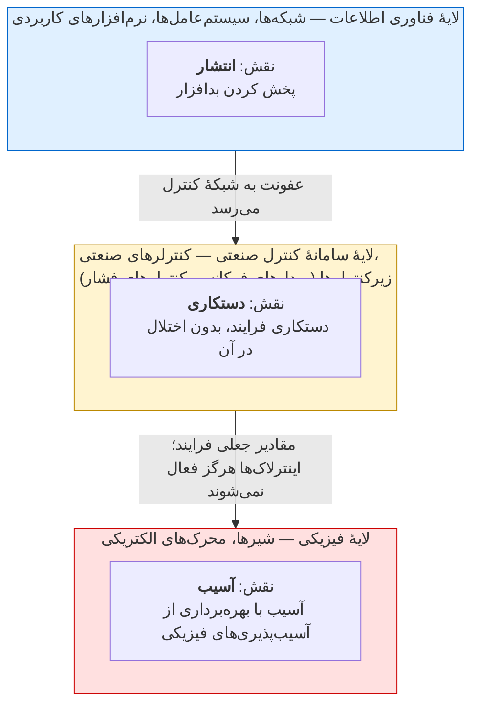

**چرا برای دفاع اهمیت دارد:** کنترل‌های متعارف امنیت اطلاعات فقط **لایهٔ ۱** را هدف می‌گیرند.

---

## ۲. دو محمولهٔ حمله (شکل ۲)

هر دو روتور را نابود می‌کنند، اما از آسیب‌پذیری‌های فیزیکی متفاوت — و **پیچیده‌ترین آن‌ها اول بود**.

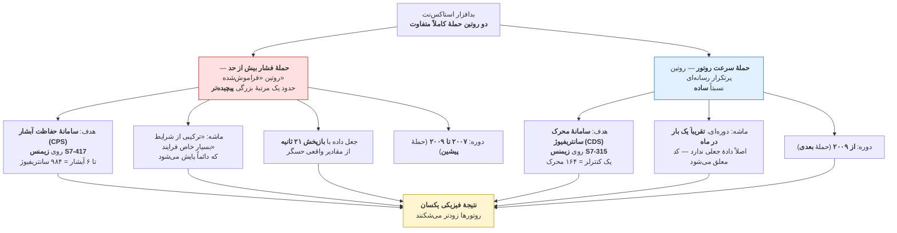

> **افسانه‌ای که این سند تصحیح می‌کند:** بیشتر روایت‌ها ادعا می‌کنند حملهٔ سرعت روتور مقادیر جعلی
> بازپخش می‌کند. **چنین نیست.** بازپخش ۲۱ ثانیه‌ای «تنها در حملهٔ فشار» به کار می‌رود.

---

## ۳. سلسله‌مراتب تأسیسات نطنز

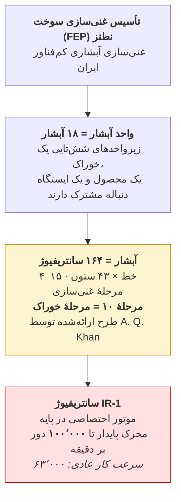

**چرا شکل آبشار مهم است:** لوله‌کشی بین‌مرحله‌ای ایران ابتدا بریده و جوش شده بود، پس شکل آبشار بدون
«کار لوله‌کشی اساسی» تغییر نمی‌کرد. اما شکل‌های کوچک‌ترِ بعدی را می‌توان «صرفاً با بستن شیرهای ایزوله،
**همان‌گونه که استاکس‌نت نشان داد**» ایجاد کرد.

---

## ۴. کنترل فشار کم‌فناور ایران و سامانهٔ dump

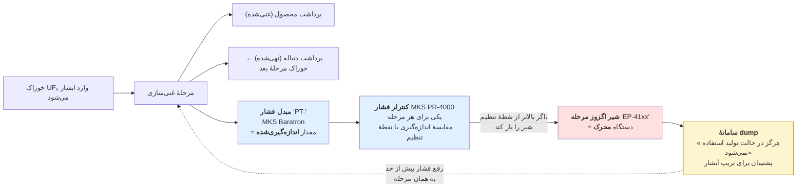

این «**کنترل پایین‌دستی بنیادی**» است — ابتدایی در برابر آبشارهای پرفناور دیگر کشورها، اما مسیر
رفع فشاری کارآمد به ایران داد؛ و همین دقیقاً چیزی بود که مهاجمون باید خنثی می‌کردند.

---

## ۵. حملهٔ فشار بیش از حد — چگونه روتورها نابود شدند

```mermaid
flowchart TB
    S0["<b>۰. کنترل کامل S7-417</b><br/>«بلافاصله پس از آلودگی، payload این نسخهٔ قدیمی<br/>کنترل را به‌طور کامل در اختیار می‌گیرد.»<br/>منطق مشروع از I/O الکتریکی <b>جدا می‌شود</b><br/>— استقرار یک <b>مرد میانی</b> روی سیگنال‌ها."]
    S0 --> S1["<b>۱. انتظار برای ماشه</b><br/>«ترکیبی از شرایط بسیار خاص فرایند که دائماً<br/>توسط کد مخرب پایش می‌شود»"]
    S1 --> S2["<b>۲. ضبط ۲۱ ثانیه از مقادیر واقعی حسگرها،<br/>سپس بازپخش حلقوی آن‌ها</b><br/>→ صفحه‌های SCADA و منطق آلارم<br/><b>عملکرد کاملاً عادی</b> را می‌بینند"]
    S2 --> S3["<b>۳. ایزوله کردن سانتریفیوژها</b><br/>بستن شیرهای ایزولهٔ مراحل<br/><b>۱، ۲، ۱۴ و ۱۵</b> → انسداد خروج محصول و دنباله.<br/>سپس ایزوله کردن سانتریفیوژهای بیشتر<br/><b>جز در مرحلهٔ خوراک</b>."]
    S3 --> S4["<b>۴. UF₆ وارد می‌شود، چیزی خارج نمی‌شود</b><br/>→ فشار کاری <b>پیوسته</b> بالا می‌رود"]
    S4 --> S5["<b>۵. ناکالیبراسیون حسگرهای فشار</b><br/><i>(فرض صریح نویسنده)</i><br/>بازنویسی خطی‌سازی تا کنترلر «همهٔ خوانش‌های<br/>آنالوگ را کاملاً عادی تفسیر کند».<br/>→ شیرهای اگزوز <b>هرگز باز نمی‌شوند</b>.<br/><b>همچنین حسگرهای هدر خوراک، برداشت محصول<br/>و دنباله + مبدل‌های شمارهٔ ۱۶ تا ۲۱</b>"]
    S5 --> S6["<b>۶. افزایش تنش روتور</b><br/>«فشار دیوارهٔ روتور تابعی از سرعت و فشار کاری است».<br/>UF6 در حدود <b>۱۰۰ میلی‌بار</b> در دمای اتاق جامد می‌شود."]
    S6 --> S7["<b>۷. توقف بر پایهٔ وضعیت</b><br/>«بر پایهٔ پایش وضعیت سانتریفیوژها،<br/><b>به احتمال بیشتر حسگرهای ارتعاش</b>»"]
    S7 --> S8["<b>قصد: افزایش تنش روتور تا <i>زودتر</i> بشکنند —<br/>«اما نه لزوماً در طول اجرای حمله»</b>"]

    style S2 fill:#e0f0ff
    style S5 fill:#ffe0e0,stroke:#c00
    style S8 fill:#fff4d0,stroke:#b80
```

**چرا این حمله دشوار است:** انجماد UF6 «صدها سانتریفیوژ به ازای هر کنترلر آلوده» را نابود می‌کرد،
اما «پرده را کنار می‌زد، زیرا علتش در تحلیل پس از مرگ نسبتاً آسان کشف می‌شد.»

---

## ۶. حملهٔ سرعت روتور — ساده و پرسروصدا

```mermaid
flowchart TB
    R0["<b>۰. تزریق در بالای main executive کنترلر S7-315</b><br/>(شکل ۱۰ — در نرم‌افزار مهندسی قابل مشاهده است)"]
    R0 --> R1["<b>۱. معلق کردن کل کد کنترل مشروع</b><br/>دستور شرطی <b>BLOCK END (BEB)</b> به محیط اجرا<br/>می‌گوید به بالای main executive بازگردد؛<br/>چون این حلقه بی‌نهایت است، حمله تکرار و<br/>همهٔ کدهای بعدی معلق می‌شوند."]
    R1 --> R2["<b>۲. اصلاً نیازی به دادهٔ جعلی نیست</b><br/>سرعت روتور «به‌سادگی توسط مبدل فرکانس تنظیم<br/>و ثابت نگه داشته می‌شود» و <b>متغیر کنترلی نیست</b>.<br/>SCADA حافظهٔ کهنهٔ کنترلر را می‌خواند و<br/>دقیقاً مقادیر پیش از حمله را نشان می‌دهد —<br/>که چون سرعت ثابت است، طبیعی به نظر می‌رسد."]
    R2 --> R3["<b>۳. توالی الف — سرعت بیش از حد</b><br/>۶۳٬۰۰۰ → <b>۸۴٬۶۰۰</b> دور بر دقیقه<br/>به مدت <b>۱۵ دقیقه</b> (شامل شتاب‌گیری چنددقیقه‌ای)"]
    R3 --> R4["<b>۴. توالی ب — اجرای متوالی بعدی</b><br/>رساندن عملاً تا توقف (<b>۱۲۰</b> دور بر دقیقه)،<br/>سپس شتاب‌گیری مجدد — در مجموع <b>۵۰ دقیقه</b>.<br/>مبدل «مانند رخداد ایزوله/کاهش سرعت، نرم decelerate می‌کند»."]
    R4 --> R5["<b>۵. چرا روتورها می‌شکنند</b><br/>IR-1 طرحی <b>فوق‌بحرانی</b> است: بالای سرعت‌های بحرانی<br/>ارتعاش‌کنندهٔ روتور کار می‌کند.<br/>«هر بار که روتور از این سرعت‌های بحرانی، که<br/><b>هارمونیک</b> نامیده می‌شوند، عبور کند می‌تواند بشکند.»<br/>کاهش و شتاب‌گیری مجدد، هر روتور را دوباره از آن‌ها عبور می‌دهد."]
    R5 --> R6["<b>۶. تناوب: تقریباً یک بار در ماه</b>"]
    R6 --> R7["<b>۷. پرسروصدا — و بدون تلاش برای پنهان‌سازی</b><br/>«هیچ تلاشی برای غیرفعال کردن سامانهٔ حفاظت آبشار<br/>در طول حملهٔ سرعت روتور انجام نشده بود» — که<br/>«تنها به قطعه‌ای کوچک از کد حملهٔ فشار نیاز داشت».<br/>مسدود کردن کد کنترل تا یک ساعت برای مهندس کنترل<br/>باتجربه قابل‌تشخیص است؛ و نوسان ۱۶۴ سانتریفیوژ<br/>بین ۶۳٬۰۰۰ تا ۱۲۰ شنیدنی است."]

    style R2 fill:#e0f0ff
    style R5 fill:#fff4d0,stroke:#b80
    style R7 fill:#ffe0e0,stroke:#c00
```

---

## ۷. معماری کنترل و سطح حمله

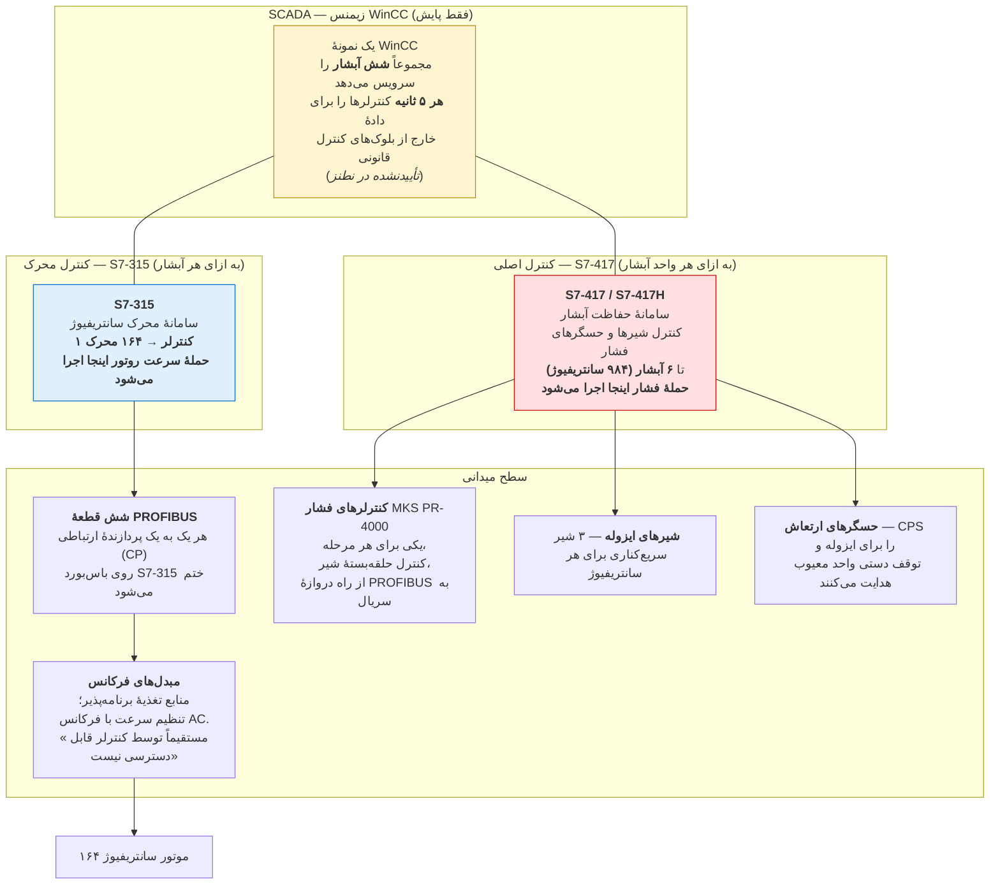

**ردّ جنابی (شکل ۱۱):** WinCC آلوده هر **پنج ثانیه** دادهٔ خارج از بلوک‌های قانونی را جست‌وجو می‌کند.

---

## ۸. نفوذ غیرمستقیم از راه اهداف نرم

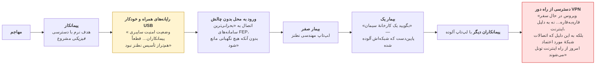

**انتشار عمداً محدود:** «انتشار تنها میان رایانه‌هایی ممکن است که به یک شبکهٔ منطقی متصل‌اند یا از راه
خودکار USB فایل رد و بدل می‌کنند.»

**بدون کلید توقف:** جست‌وجوی سادهٔ نام فایل **`s7otbxsx.dll`** کافی بود.

---

## ۹. گاه‌شمار

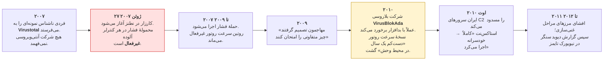

نام عملیاتی ادعایی: **«عملیات المپیک گیمز»**.

---

## ۱۰. چرا دفاع‌های متعارف کار نمی‌کنند

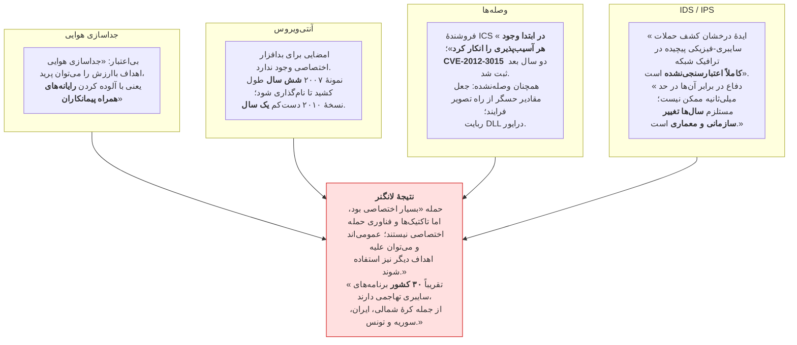

---

## ۱۱. درس‌هایی که استاکس‌نت به مهاجمون آینده می‌دهد

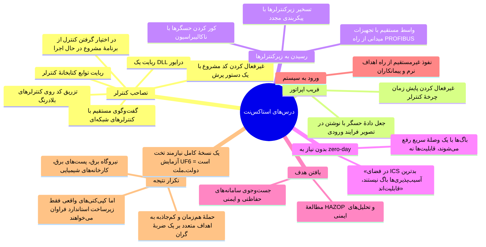

