# Diagrams — Krasznay "Case Study: The NotPetya Campaign"

Mermaid diagrams redrawn from *Case Study: The NotPetya Campaign*, Csaba Krasznay,
in *Cyber Diplomacy from the European Perspective*, Ludovika University Press / National
University of Public Service, pp. 109–127, DOI 10.36250/01039_05.

The chapter contains **no printed figures or tables**; the diagrams below are built from its
chronology, its technical narrative, and the three enumerated lists it cites.

---

## 1. Chronology: from preparation to coordinated attribution

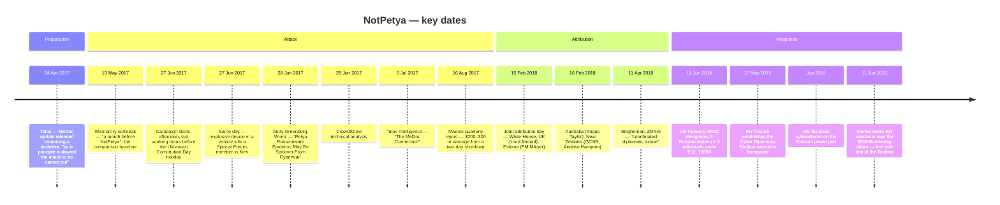

**Why the date matters:** choosing a prominent national holiday as the start was "a signal
message", and it also meant "the majority of IT operators would be on leave, so the defence
would work with lower resources."

---

## 2. The NotPetya kill chain

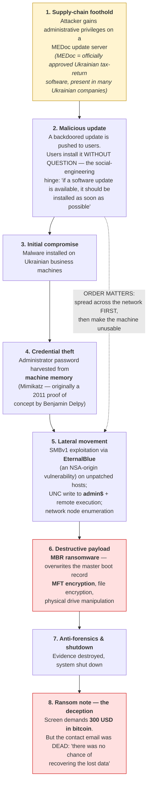

**The "spread first, destroy later" ordering is the tell.** A financially motivated actor needs the
machine alive and a working decryption channel. Here the machine is destroyed and the mailbox is
dead — so the ransom demand was camouflage, not a business model.

---

## 3. WannaCry vs. NotPetya — why the chapter contrasts them

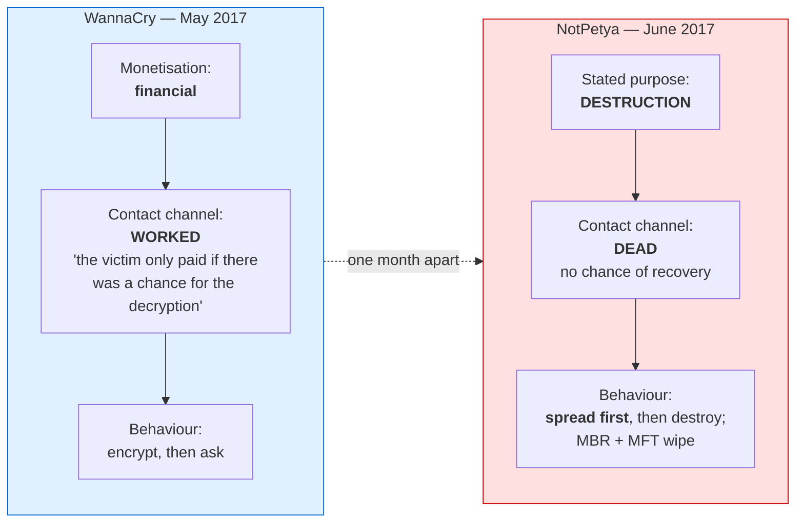

**Two further asymmetries the chapter stresses:**
- **Update vector** — WannaCry had *no* hidden code and *no* "kill switch". NotPetya's backdoor had
  been sitting in MEDoc since 24 April 2017, so the attackers "started preparing for the action
  months earlier." The attacker "was clearly after the largest, geographically most localised
  destruction."
- **Infrastructure** — no massive pre-infected botnet. "There was not a complex network
  infrastructure with millions of previously infected computers in the botnet, as the attack was
  targeted, originated from the MEDoc update server."

---

## 4. International law: the three obligations (after Schmitt & Biller)

Krasznay adopts the Schmitt–Biller analysis, which anchors accountability in attribution.

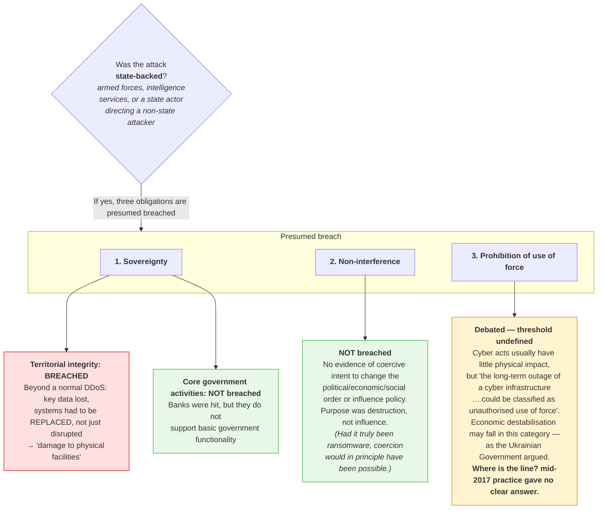

### 4b. If an armed conflict is presumed: IHL and the war-crime framing

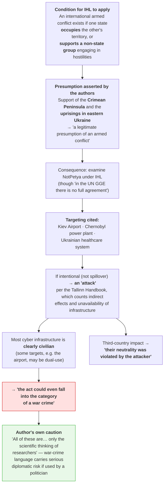

---

## 5. Coordinated attribution, February 2018

The chapter calls this the real breakthrough: attribution used *jointly* for the first time.

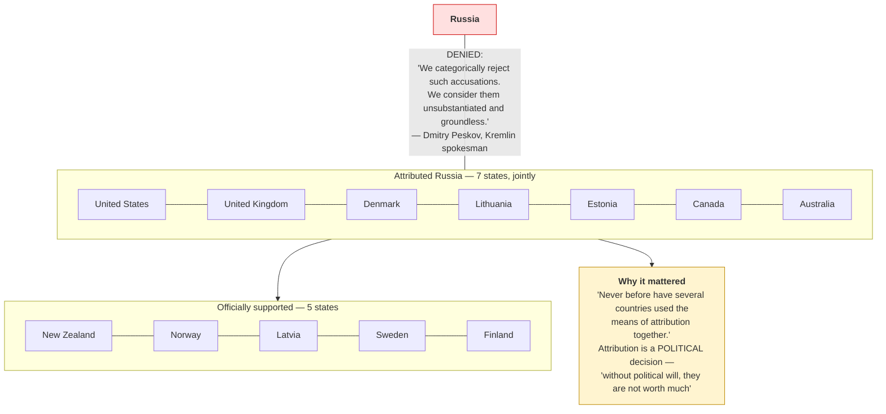

### 5b. Who spoke, and what that reveals about priorities

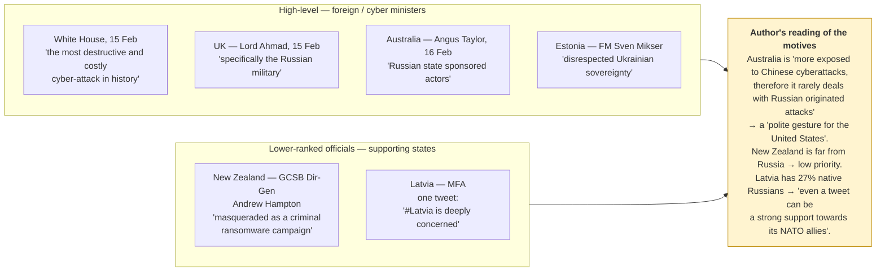

---

## 6. Deterrence in cyberspace (after Taddeo)

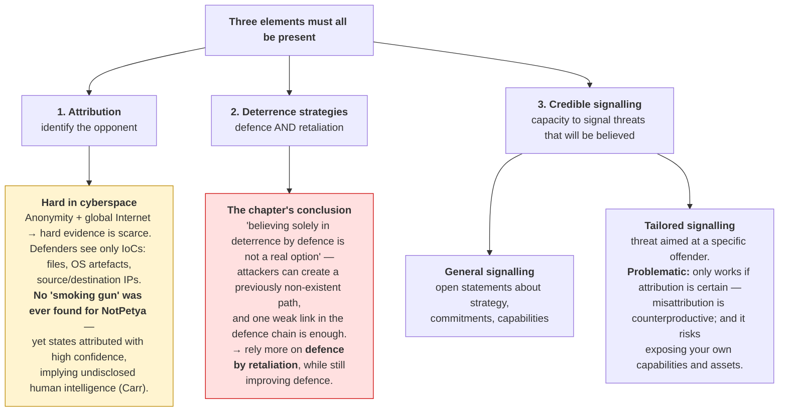

### 6b. "Flashing their capabilities" — the four examples the chapter gives

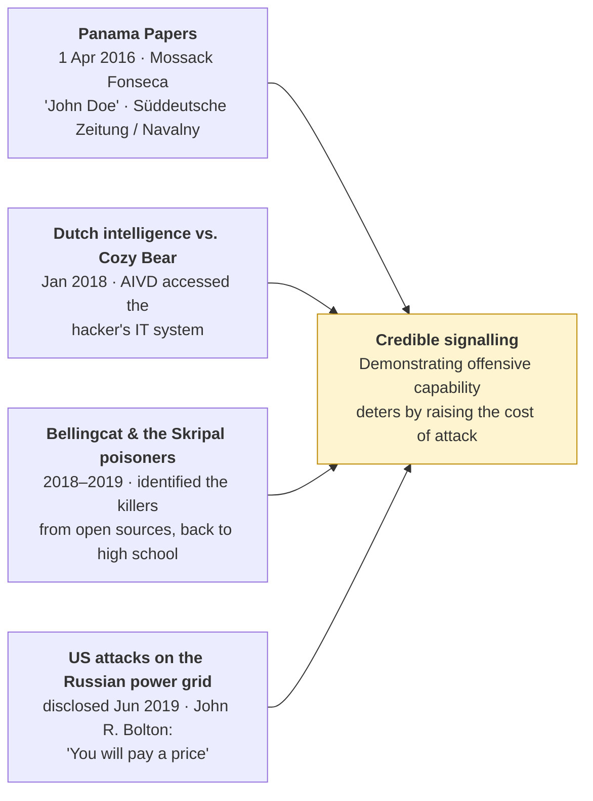

---

## 7. The EU response toolbox — instruments available to states

The list Moret & Pawlak (EUISS, July 2017) give for answering a cyber attack.

```mermaid
flowchart TB
    subgraph DIP["Diplomatic / political"]
        direction LR
        D1["Statements &amp; demarches"] --- D2["EU demarches"] --- D3["Council conclusions"] --- D4["Political &amp; cyber dialogues"]
    end
    subgraph LAW["Legal"]
        direction LR
        L1["International agreements"] --- L2["Sanctions"] --- L3["Solidarity clause"] --- L4["Mutual Defence Clause"]
    end
    subgraph PROC["Procedural / capacity"]
        direction LR
        P1["Capacity building"] --- P2["Joint investigations"] --- P3["Formal request for assistance"] --- P4["Recalling diplomats"] --- P5["HR/VP statements"]
    end
    subgraph HARD["Hard response"]
        direction LR
        H1["Countermeasures"] --- H2["Military response"]
    end
    subgraph STRAT["Strategic"]
        S1["Strategic communication"]
    end
    P["Instrument menu<br/>(escalating severity)"] --> DIP
    P --> LAW
    P --> PROC
    P --> HARD
    P --> STRAT
    style H1 fill:#ffe0e0,stroke:#c00
    style H2 fill:#ffe0e0,stroke:#c00
```

### 7b. EU Cyber Diplomacy Toolbox, 17 May 2019 — scope and measures

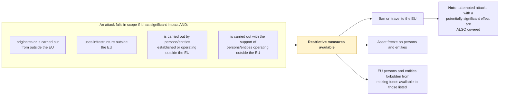

---

## 8. Attribution evidence researchers were told to look for

The chapter reproduces CrowdStrike's forensic checklist — useful as a detection-oriented diagram.

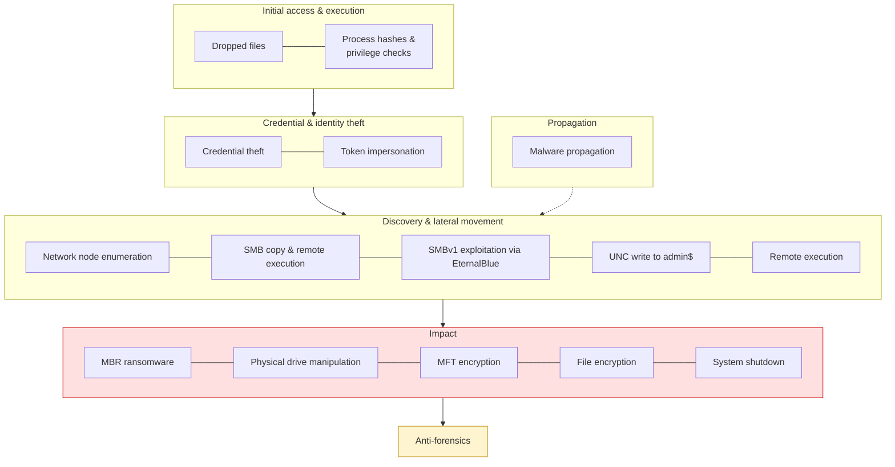
