# Diagrams — Langner (2013) "To Kill a Centrifuge"

Mermaid diagrams redrawn from the technical content of
*To Kill a Centrifuge: A Technical Analysis of What Stuxnet's Creators Tried to Achieve*,
Ralph Langner, The Langner Group (Arlington | Hamburg | Munich), November 2013. 37 pages, 13 numbered
figures, no tables.

> **Attribution caution.** This document is an *attack-vector and plant-intelligence* study, **not** an
> IOC/forensic catalogue. It contains no certificate names, no mutexes, no registry keys, no C2 domains,
> and does **not** mention WinStux, Stuxnet.RT, the four-component decomposition, PROFINET/ProfiSAFE,
> PCS 7, or the "121 rotor variables". Those belong to other analyses. Everything below is sourced from
> this document.

---

## 1. The three layers of a cyber-physical attack (Figure 1)

Stuxnet is Langner's "textbook example" of a cyber-physical attack: each layer has its own
vulnerability, and damage requires traversing all three.

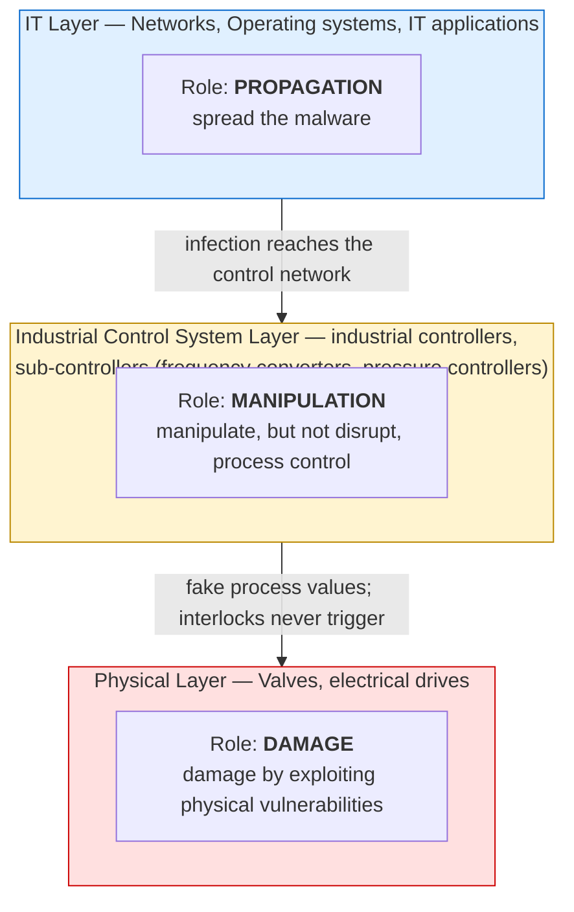

**Why this matters for defence:** conventional infosec controls (air gaps, anti-virus, patching, IDS)
address **layer 1 only**. Langner's complaint is that post-Stuxnet mitigation advice "all indications
[of] a failure to understand how the attack actually worked."

---

## 2. The two attack payloads (Figure 2)

Both destroy centrifuge rotors, but by different physical vulnerabilities — and the complex one came
**first**.

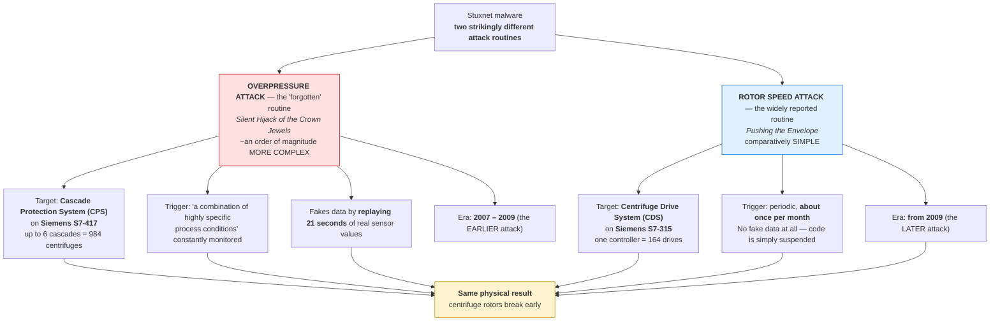

**The two payloads are entirely independent:** different PLC families, different control systems, and
"**no linkage whatsoever**" between them. Langner's team first assumed the rotor-speed attack would
disable the CPS to protect itself; "no coordination between the two attacks can be found in code."

> **A popular myth this document corrects:** most accounts claim the rotor-speed attack replays fake
> process values. It does **not**. The 21-second record/replay "is only used in the overpressure
> attack" and "wouldn't even work on the smaller controller for technical reasons."

---

## 3. Natanz enrichment plant hierarchy (Section C)

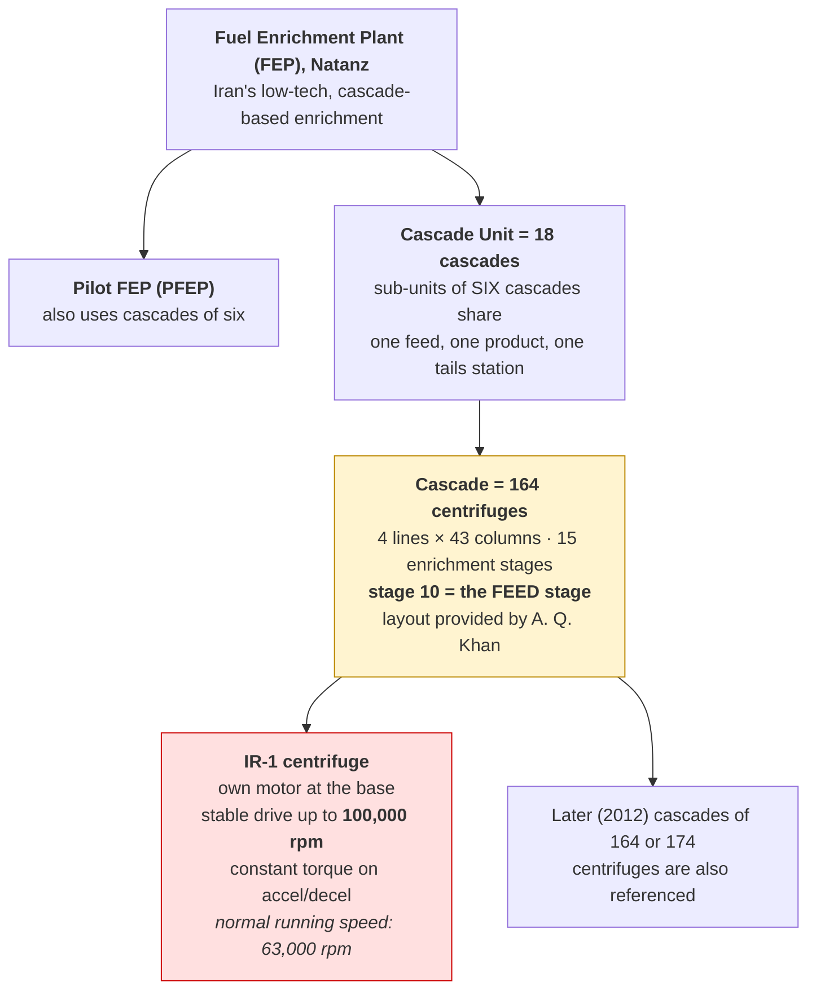

**Why the cascade shape matters:** Iranian inter-stage piping was originally cut and welded (a "fixed
configuration"), so the shape could not change "without a major pipe job." The reduced cascade shapes
observed later can instead be made "simply by closing isolation valves, **as Stuxnet demonstrated**"
(Figure 6) — which raises the question of whether IAEA inspectors could detect temporary
reconfiguration between visits.

---

## 4. Iran's low-tech pressure control and the dump system

The design the attackers had to abuse. Understanding it is the key to the overpressure attack.

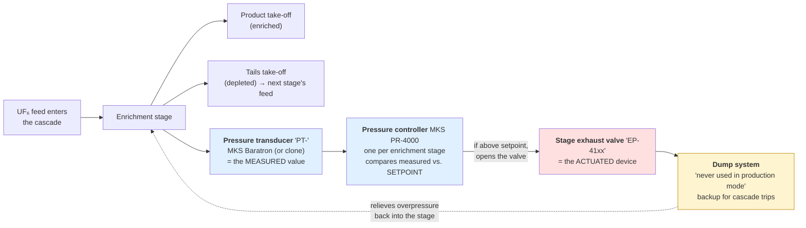

This is "**basic downstream control**" — crude compared with the high-tech pressure-control cascades
other states use, but it gave Iran a working overpressure-relief path, which is precisely what the
attackers needed to neutralise.

**Likely built 2003–2006** (Langner: "It can be speculated"), after the EU3 requested an enrichment
suspension in October 2003. Probably **not** from the Khan network: PROFIBUS was first published in
**1993**, the S7-417 entered the market "not earlier than **1999**", fieldbus adoption takes "around
ten years", and "there is no evidence of a close relation between Iran and the Khan network after 1994."

---

## 5. Overpressure attack — how the rotors were destroyed

```mermaid
flowchart TB
    S0["<b>0. Take over the S7-417 completely</b><br/>'Immediately after infection the payload of this early<br/>Stuxnet variant takes over control completely.'<br/>Legitimate logic is <b>decoupled from electrical I/O</b><br/>— a man-in-the-middle on the signals.<br/>When the attack is NOT running, the malware restores<br/>legitimate access — replicating a controller OS function."]

    S0 --> S1["<b>1. Wait for the trigger</b><br/>'a combination of highly specific process conditions<br/>that are constantly monitored by the malicious code'"]
    S1 --> S2["<b>2. Record 21 seconds of real sensor values,<br/>then replay them in a constant loop</b><br/>→ SCADA screens and alarm routines see<br/><b>perfectly normal operation</b>"]
    S2 --> S3["<b>3. Isolate centrifuges</b><br/>Close the isolation valves of stages<br/><b>1, 2, 14 and 15</b> → blocks product and<br/>tails outflow.<br/>Then isolate MORE centrifuges everywhere<br/><b>EXCEPT the feed stage</b>."]
    S3 --> S4["<b>4. UF₆ in, nothing out</b><br/>UF₆ keeps entering via the feed but cannot escape<br/>→ operating pressure rises <b>continuously</b>"]
    S4 --> S5["<b>5. De-calibrate the pressure sensors</b><br/><i>(author's stated assumption)</i><br/>Overwrite the sensor linearisation so the controller<br/>'interpret[s] all analog pressure readings as perfectly<br/>normal pressure no matter how high or low'.<br/>→ the stage exhaust valves <b>never open</b>.<br/><b>Also compromised: feed-header, product take-off and<br/>tails take-off sensors</b>, plus the extra transducers<br/><b>numbered 16 to 21</b> in the plant and in the attack code."]
    S5 --> S6["<b>6. Rotor stress rises</b><br/>'rotor wall pressure is a function of velocity<br/>(rotor speed) and operating pressure'.<br/>UF₆ solidifies at about <b>100 millibar</b> at room temperature."]
    S6 --> S7["<b>7. Abort on status</b><br/>'based on monitoring centrifuge status,<br/><b>most likely vibration sensors</b>, which suggests<br/>a mission abort before the matter hits the fan'"]
    S7 --> S8["<b>Intent: increase rotor stress so rotors break early —<br/>'but not necessarily during the attack run'</b>"]

    style S2 fill:#e0f0ff
    style S5 fill:#ffe0e0,stroke:#c00
    style S8 fill:#fff4d0,stroke:#b80
```

**Why this is the hard attack — and why the intermittency is the smoking gun.** Solidification of UF₆
would have destroyed "hundreds of centrifuges per infected controller," but "would also have blown
cover since its cause would have been detected fairly easily by Iranian engineers in post mortem
analysis." Langner's reading: the goal was **"low-yield by purpose"** — shorten centrifuge lifetime
and demoralise engineers, rather than cause visible catastrophe.

**Why the exhaust valves must stay closed but the feed valves open (Figure 8):** the stage exhaust
valves (`EP-4108`–`EP-4112`) stay closed throughout, "while at least one of the feed valves
(`EP-4118`–`EP-4120`) must stay open." Otherwise critical-high feed with low product and tails would
auto-close the master feed valves and raise an alarm.

---

## 6. Rotor speed attack — the simple, loud attack

```mermaid
flowchart TB
    R0["<b>0. Inject at the top of the S7-315 main executive</b><br/>(Figure 10 — visible in the engineering software)"]
    R0 --> R1["<b>1. Suspend ALL legitimate control code</b><br/>A conditional <b>BLOCK END (BEB)</b> directive tells the<br/>runtime to jump back to the top of the main executive,<br/>which loops on the single-tasking controller —<br/>re-iterating the attack and skipping all later code."]
    R1 --> R2["<b>2. No fake data is needed</b><br/>Rotor speed 'is simply set and then held constant<br/>by the frequency converter' and is <b>not a controlled<br/>variable</b>. SCADA reads stale controller memory,<br/>so it shows the exact pre-attack values —<br/>which look normal, because speed IS constant."]
    R2 --> R3["<b>3. Sequence A — over-speed</b><br/>63,000 rpm → <b>84,600 rpm</b><br/>(+ about one third) held for <b>15 minutes</b><br/>including a multi-minute acceleration"]
    R3 --> R4["<b>4. Sequence B — next consecutive run</b><br/>brought 'basically to a stop (<b>120 rpm</b>)',<br/>then sped up again — <b>50 minutes</b> total.<br/>The converter 'smoothly decelerates just like in an<br/>isolation / run-down event'."]
    R4 --> R5["<b>5. Why it breaks rotors</b><br/>The IR-1 is a <b>supercritical design</b>: it runs ABOVE<br/>critical speeds that make the rotor vibrate.<br/>'Every time a rotor passes through these critical<br/>speeds, also called <b>harmonics</b>, it can break.'<br/>Decelerating and re-accelerating sweeps every rotor<br/>back through them."]
    R5 --> R6["<b>6. Cadence: about once per month</b>"]

    R6 --> R7["<b>7. Loud — and no attempt to hide the CPS</b><br/>'no attempts had been made to disable the Cascade<br/>Protection System during the rotor speed attack'<br/>— which 'would only have required a very small piece<br/>of attack code from the overpressure attack'.<br/>Blocking control code for up to an hour is detectable by<br/>an experienced engineer; 164 centrifuges swinging from<br/>63,000 to 120 rpm is audible — 'if experienced staff<br/>had been cautious enough to remove protective headsets'."]

    style R2 fill:#e0f0ff
    style R5 fill:#fff4d0,stroke:#b80
    style R7 fill:#ffe0e0,stroke:#c00
```

**The absence of CPS interference is itself evidence.** Langner reads it as proof that catastrophic
destruction was not the intent — the attackers had the code and chose not to use it.

---

## 7. The control architecture and the attack surface

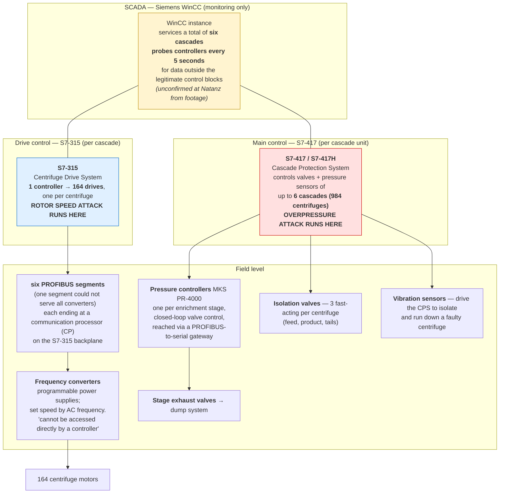

**Forensic tell (Figure 11):** the infected WinCC polls every **five seconds** for data outside the
legitimate control blocks. "In a proper forensic lab setup this produces traffic that simply cannot be
missed."

**SCADA is not the target.** Langner is explicit that SCADA "does not directly interfere with actuator
devices" — all process manipulation happened on the controllers.

---

## 8. How Stuxnet got in — indirect infiltration via soft targets

Attacking "fifteen firewalls, three data diodes, and an intrusion detection system" is pointless.
The attackers used trusted third parties instead.

```mermaid
flowchart LR
    A["<b>Attacker</b>"] --> B["<b>Contractor</b><br/>a soft target with legitimate<br/><i>physical</i> access to the site"]
    B --> C["<b>Mobile computers &amp; USB sticks</b><br/>'cybersecurity posture of contractors…<br/>certainly was not at par with the Natanz<br/>Fuel Enrichment facility'"]
    C --> D["<b>Carried on site unchallenged</b><br/>connected to 'the FEP's most critical systems,<br/>unchallenged by any guards'"]

    D --> E["<b>Patient Zero</b><br/>the Natanz engineering laptop<br/>(Field PG / SIMATIC Manager)"]
    E --> F["<b>Patient One</b><br/>'let's say a cement plant' —<br/>downstream, whose network is now infected"]
    F --> G["<b>Other contractors</b> carrying infected laptops in"]
    G --> H["<b>VPN remote access</b><br/>'the virus to travel over continents… not because<br/>of the Internet, but because trusted network<br/>connections are tunneled through the Internet'"]
    H -.->|"this is the intended explanation for the legend of<br/>'roughly 100,000 infected computer systems worldwide'"| I["Scale"]

    style C fill:#fff4d0,stroke:#b80
    style H fill:#ffe0e0,stroke:#c00
```

**Two infection models, by era:**
- **Early (2007) variant** — had to be *physically installed*, "most likely a portable engineering
  system," or passed on "a **USB stick** carrying an infected configuration file for Siemens
  controllers." No engineering software to open the malicious file, so no propagation.
- **Rotor-speed variant** — added real self-replication "within trusted networks and via USB sticks
  even on computers that did not host the engineering software application."

**Propagation is deliberately narrow:** "propagation can only occur between computers that are attached
to the same logical network or that exchange files via USB sticks. The propagation routines never make
an attempt to spread to random targets."

**There is no kill switch** — "there is no logic implemented in the malware which could actively
disable the malicious code on infected controllers." A simple filename search for **`s7otbxsx.dll`**
would have found it.

---

## 9. Timeline

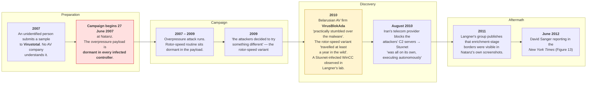

Alleged operational code name: **"Operation Olympic Games."**
(Duqu and Flame are named in the document but explicitly "outside the scope of this paper.")

---

## 10. Was Stuxnet a success? — the "low-yield by purpose" argument

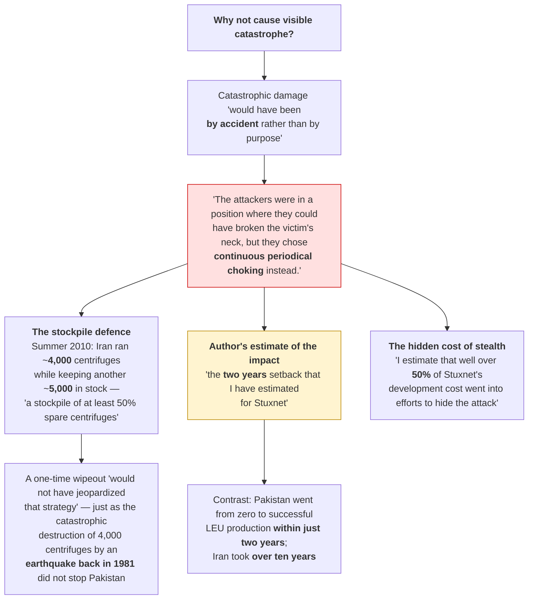

---

## 11. Why OPSEC decayed — the pivot Langner infers

```mermaid
flowchart TB
    O1["<b>The problem the overpressure routine created</b><br/>The routines 'were still contained in the payload,<br/>but <b>no longer executed</b> — a fact that must be<br/>viewed as deficient OPSEC'"] --> O2["But paradoxically this<br/>'provided us by far the best forensic evidence<br/>for identifying Stuxnet's target'"]

    O2 --> P1["<b>Suggested explanation (speculation)</b><br/>Priorities shifted between 2008 and 2009.<br/>'the circle seems to have gotten much wider,<br/>with a <b>new center of gravity in Maryland</b>'<br/>Possibly the original crew was 'taken out of command<br/>by a casual \"we'll take it from here\" by people<br/>with higher pay grades'."]

    P1 --> P2["<b>Consequence: the envelope was pushed</b>"]
    P2 --> Q1["Added 'the latest and greatest MS Windows exploits<br/>and <b>stolen digital certificates</b>', letting the malware<br/>pose as legitimate driver software"]
    P2 --> Q2["Dropped evasion — control code blocked for up to an hour"]
    P2 --> Q3["Ran <b>audibly</b> at 63,000 → 120 rpm"]
    P2 --> Q4["WinCC probed controllers <b>every 5 seconds</b>"]
    Q1 --> R["'they were certainly <b>pushing the envelope<br/>and accepting the risk</b>'"]
    Q2 --> R
    Q3 --> R
    Q4 --> R

    style P1 fill:#fff4d0,stroke:#b80
    style R fill:#ffe0e0,stroke:#c00
```

**Why they might not have cared:** "Digital weapons work", they are stealthy and "dirt cheap";
"Nuclear proliferators come and go, but cyber warfare is here to stay"; uncovering Stuxnet ends the
operation but not its utility as a "deterrent display of cyber power"; and it avoids "another Sputnik
moment."

---

## 12. What Stuxnet teaches future attackers (Section B)

Langner's central argument: these are **generic techniques**, not target-specific tricks.

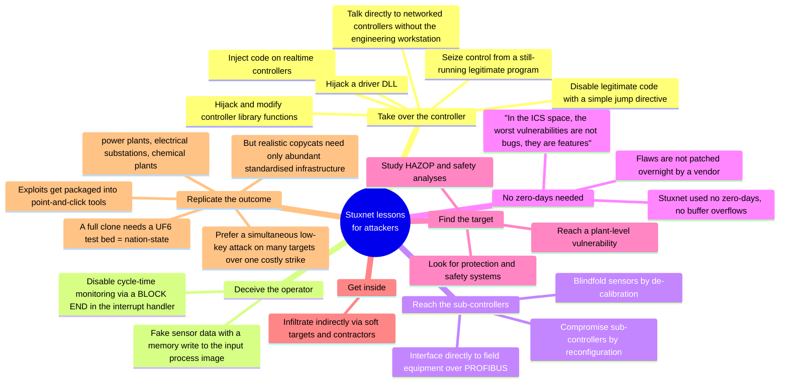

**The "no zero-days" point, in Langner's words:** "At the control system level, Stuxnet did not
exploit any zero-day vulnerabilities, buffer overflows or other fancy geek stuff, but **legitimate
product features**. In the industrial control system space, the worst vulnerabilities are not bugs,
they are features." Advantage: "They will not be fixed over night by a vendor releasing a 'patch'."

**Important nuance on resources:** a *faithful* Stuxnet clone **would** need nation-state capability,
because testing "must have involved a fully-functional mockup IR-1 cascade operating with real uranium
hexafluoride." But a *realistic copycat* does not — adversaries will go where critical infrastructure
is "plentiful, accessible, and standardised."

---

## 13. Why conventional defences do not work

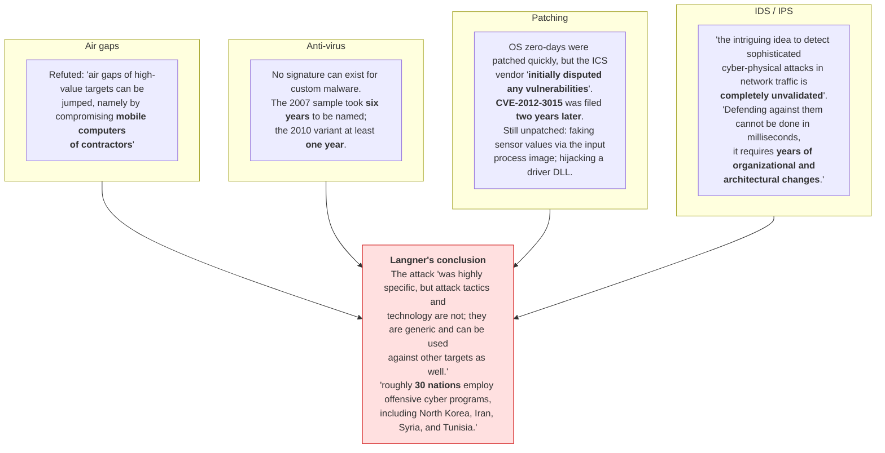

**And the warning:** "It should be take[n] for granted that every serious cyber warrior will copy
techniques and tactics used in history's first true cyber weapon."
